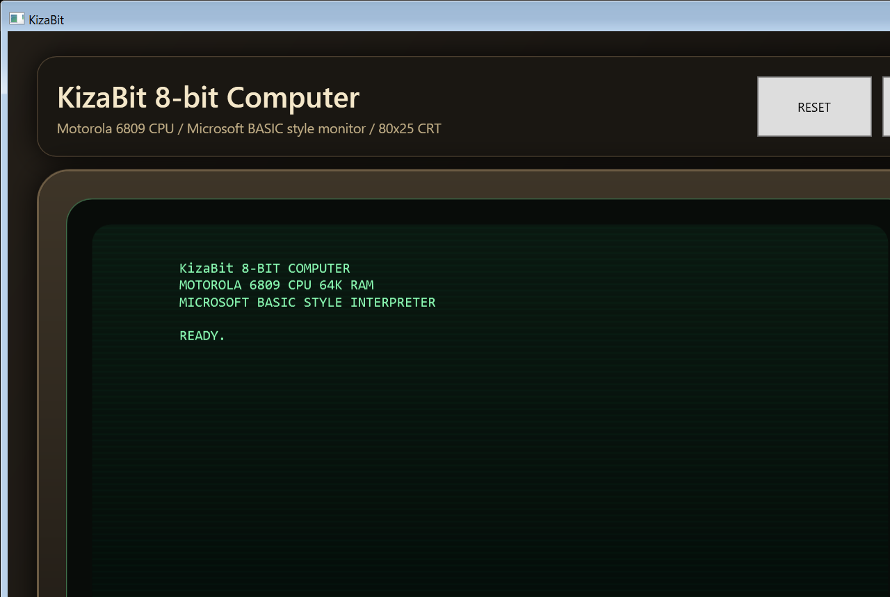

# KizaBit

KizaBit は、WPF で動作するレトロ風の 8-bit コンピューターシミュレーターです。80x25 の CRT 風画面、簡易 Motorola 6809 CPU、Microsoft BASIC 風インタープリターを 1 つのウィンドウで操作できます。

## スクリーンショット



## 動作環境

- Windows
- .NET 10 SDK

このアプリは WPF を使用しているため、Windows 環境が必要です。

## 起動方法

リポジトリのルートで次を実行します。

```powershell
dotnet run
```

ビルドのみ行う場合は次を使います。

```powershell
dotnet build
```

## 画面の見方

- 左側: 80x25 の仮想ディスプレイ
- 右側: CPU レジスタと実行状態
- 下部: コマンド入力欄

## 操作ボタン

- RESET: BASIC プログラムと CPU 状態を初期化します
- LOAD DEMO: デモ用 BASIC プログラムを読み込みます
- CPU STEP: CPU を 1 命令だけ進めます
- CPU RUN: CPU を一定間隔で連続実行します

アプリ起動時には自動的にブートメッセージが表示され、入力欄にフォーカスが移ります。

## BASIC コマンド

即時実行コマンド:

- HELP: 利用可能なコマンド一覧を表示
- NEW: 登録済みプログラムを消去
- LIST: 行番号付きプログラムを一覧表示
- RUN: 登録済みプログラムを実行
- CLS: 画面をクリア
- CPU: CPU 状態の要約を表示

使用できる文:

- PRINT
- LET
- IF ... THEN
- FOR ... NEXT
- GOTO
- GOSUB ... RETURN
- END
- REM

## BASIC の仕様

- 行番号付き入力でプログラムを保存できます
- 変数名は英字 1 文字です
- 数式は `+`, `-`, `*`, `/`, 括弧に対応します
- 条件式は `=`, `<>`, `<`, `>`, `<=`, `>=` に対応します
- 未定義変数は 0 として扱われます

## 入力例

即時実行の例:

```text
PRINT 2+2
PRINT "HELLO"
CPU
```

行番号付きプログラムの例:

```text
10 CLS
20 PRINT "KIZABIT BASIC DEMO"
30 LET A = 1
40 PRINT "COUNT=" + A
50 LET A = A + 1
60 IF A <= 5 THEN 40
70 PRINT "DONE"
RUN
```

サブルーチンとループの例:

```text
10 FOR I = 1 TO 3
20 GOSUB 100
30 NEXT I
40 END
100 PRINT "I=" + I
110 RETURN
```

## CPU について

内蔵 CPU は簡易的な Motorola 6809 風実装です。現在は以下のような基本命令の一部のみをサポートしています。

- NOP
- LDA #n / LDB #n
- LDX #nn / LDY #nn / LDS #nn
- STA addr / LDA addr
- INCA / DECA / CLRA
- ADDA #n
- BRA / BEQ / BNE
- JMP addr
- SWI

未対応命令を実行すると CPU は停止し、状態欄の LAST INSTR に内容が表示されます。

## プロジェクト構成

- App.xaml, MainWindow.xaml: WPF アプリケーションと UI
- VirtualMachine.cs: 仮想マシン全体の制御
- BasicInterpreter.cs: BASIC 風インタープリター
- M6809Cpu.cs: 簡易 CPU 実装
- DisplayBuffer.cs: 画面バッファ

## 補足

このプロジェクトは教育用・試作用のシミュレーターです。完全な 6809 エミュレーターや完全互換 BASIC ではありません。